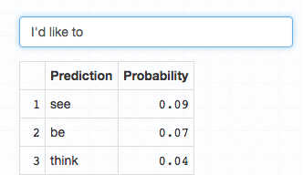

## Introduction

This app is to fullfill the requirements of the Coursera Data Science Capstone course project. Its purpose is to generate english predictions from natural language input.

Github:

App: 

## The App

The app reactively receives input text from the user and subsequently generates predictions.The top 10 results are displayed in a table, and their probability relative to the sample space is also displayed. 




By utilizing the `data.table` package predictions are returned very quickly.

## How it works

This app uses an *ngram* model with markov chain support for up to sequences of three words: two predictors and one predicted term. A backoff algorithm will revert to the bigram and unigram frequency sets when no predicted values are available in the higher order set.

**I'd** => *like*

**I'd like** => *to*

**...like to** => *see*

The corpus used to generate this model was generously provided by the SwiftKey team.

## Performance

Performance was measured against the following standards:

- Top pick accuracy

- Top 3, 5, and 10 pick accuracy, irrespective of the number of terms actually returned by the prediction algorithm.

```{r, echo=F, warning=F, message=F}
load('accuracy.Rda')
accuracy
```

As expected the chances of a correct term being returned increases with the number of predictions considered.


